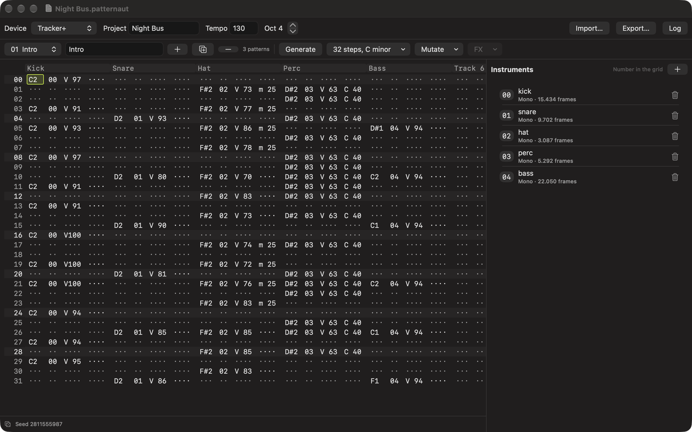

# Patternaut

A native macOS companion for the Polyend Tracker+ and Tracker Mini. It generates and varies
patterns, and writes them to your SD card as the real files the machine already reads.

[Mac App Store](https://apps.apple.com/app/id6792365053) · [patternaut.iamjarl.com](https://patternaut.iamjarl.com) ·
macOS 14 and later · $8.99 once, no subscription



## What it does

Press Generate and a beat appears: kick, snare, hat, usually percussion carrying the device's own
Chance effect, often a bass line in the key you chose. Every press is different, and every result
is reproducible from its seed. Mutate takes what is there and nudges it, from subtle to chaotic.

The editor is a tracker grid and works like one: notes on the keyboard rows, sixteen tracks, both
effect lanes per step with the device's own symbols and value ranges, undo on everything.

It reads projects back off the card as well, with their patterns, names, tempo and instruments, so
you can take something you made on the hardware, change it, and write it back without disturbing
the instrument assignments, mixer or effects the machine keeps for itself.

There is no audio engine, so it does not play patterns back. It is a companion to the hardware,
not a replacement for it.

## The file formats

The interesting part of this repo is `PatternautCore`, which reads and writes Polyend's formats in
plain Swift with no Apple-only dependencies:

| Format | What it is | Read | Write |
|---|---|---|---|
| `.mtp` | A pattern: 16 tracks of 128 steps | yes | yes |
| `.mt` | The project: tempo, track names, song playlist | yes | yes |
| `.pti` | An instrument: parameters and raw audio | yes | yes |
| `patternsMetadata` | The pattern slot names | yes | yes |

Every writer is verified byte-for-byte against Polyend's own
[`tracker-lib`](https://github.com/polyend/tracker-lib), and then against projects written by the
hardware itself, which is where the interesting differences turned up. Three of them are worth
knowing if you write tools for this device:

- **The per-track length byte is the last step index, not the step count.** Real files use 7, 31,
  63 or 127. Writing the count makes the device read one step too many.
- **The device writes `KS` as the `.mtp` signature, type 2, and the real file size in the header.**
  `tracker-lib`'s own defaults differ (`PM`, type 0, size 0).
- **`patternsMetadata` holds all 256 slots**, whatever the project uses, and the device will not
  load a project without the file.

`ProjectBundleReader` and `ProjectBundleWriter` handle a whole project folder, including stripping
the `._` companion files macOS leaves on a FAT card, which the Tracker otherwise reads as patterns.

## Building

```bash
cd PatternautCore && swift test     # the engine and its tests
cd App && xcodegen generate         # regenerate the Xcode project
open App/Patternaut.xcodeproj
```

The app needs [xcodegen](https://github.com/yonaskolb/XcodeGen); the project file is generated
from `App/project.yml`. `PatternautCore` builds and tests on its own with no Xcode involved.

## Layout

- `PatternautCore/`: the engine, pattern model, device profiles, generators, mutation, editor
  logic, MIDI sequencing and the file formats. Its own [README](PatternautCore/README.md) goes
  into detail.
- `App/`: the macOS SwiftUI app.
- `docs/`: the marketing site, served by GitHub Pages.
- `appstore/`: the App Store posters, and how they are made.

[CLAUDE.md](CLAUDE.md) is the quick-start for developers and AI assistants, and carries a precise
list of what the app does and, just as usefully, what it does not.

## Contributing

Issues and pull requests are welcome; see [CONTRIBUTING.md](CONTRIBUTING.md). Audience,
positioning and pricing are decided in a private repo rather than here.

## License

[MIT](LICENSE). Co-created with AI, [how that works](https://madebyhuman.iamjarl.com).

Patternaut is an independent app and is not affiliated with or endorsed by Polyend. Polyend,
Tracker, Tracker+ and Tracker Mini are trademarks of their respective owners.
